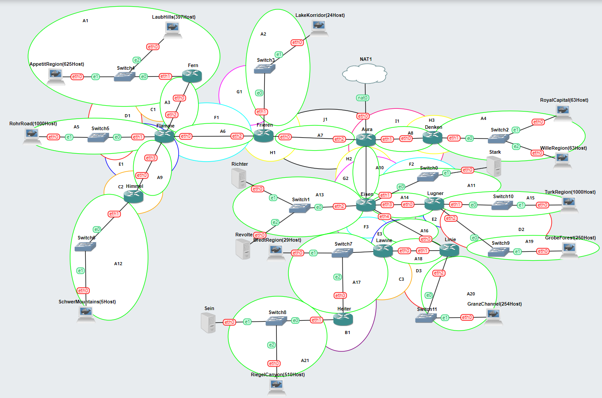
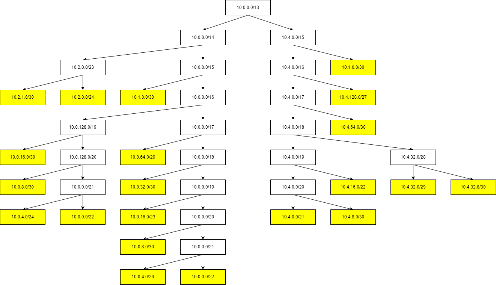
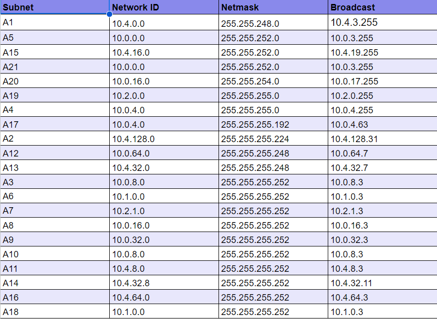
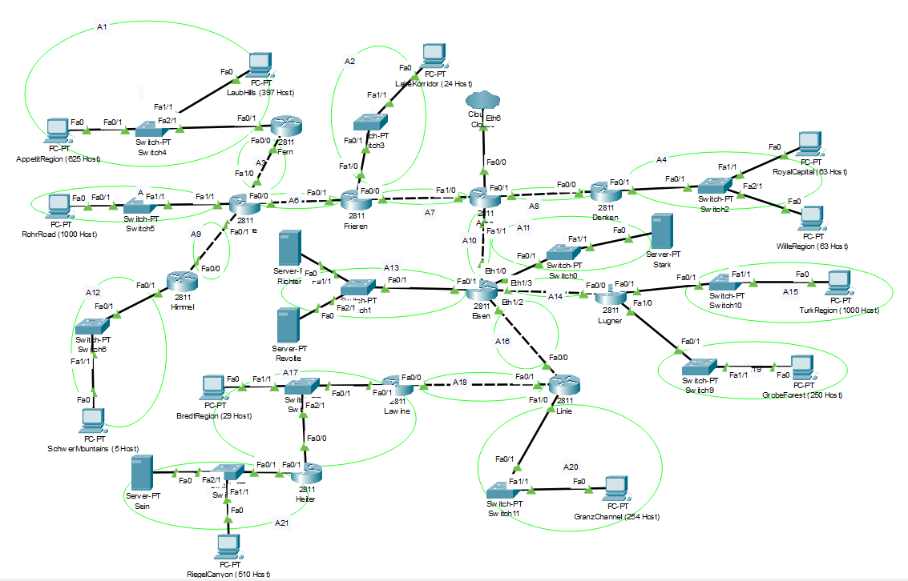
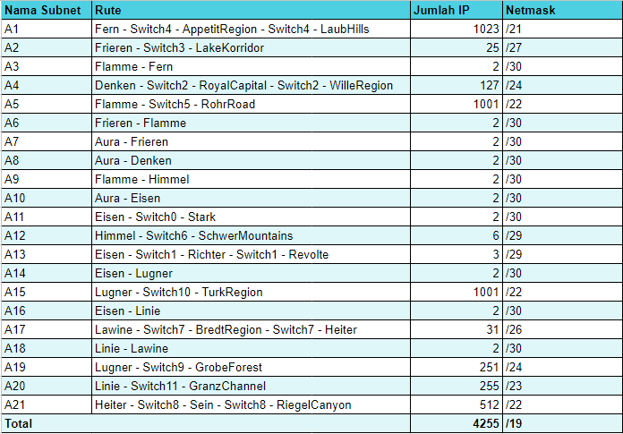
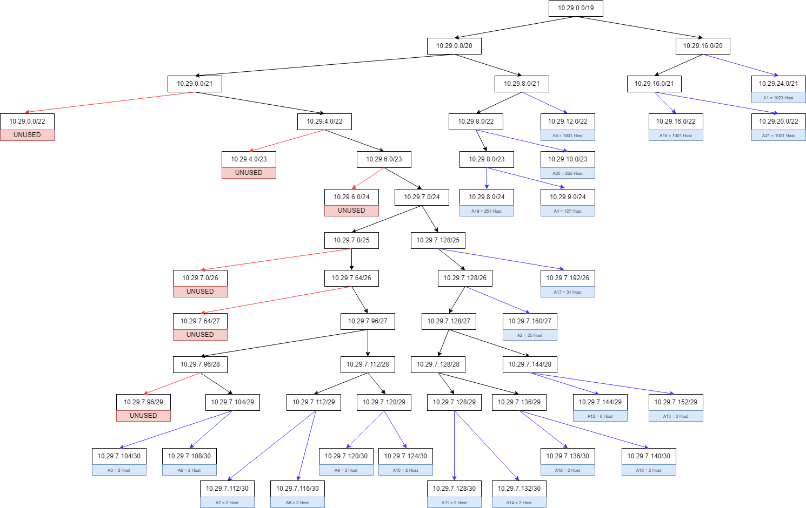
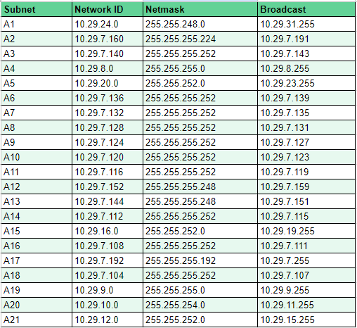
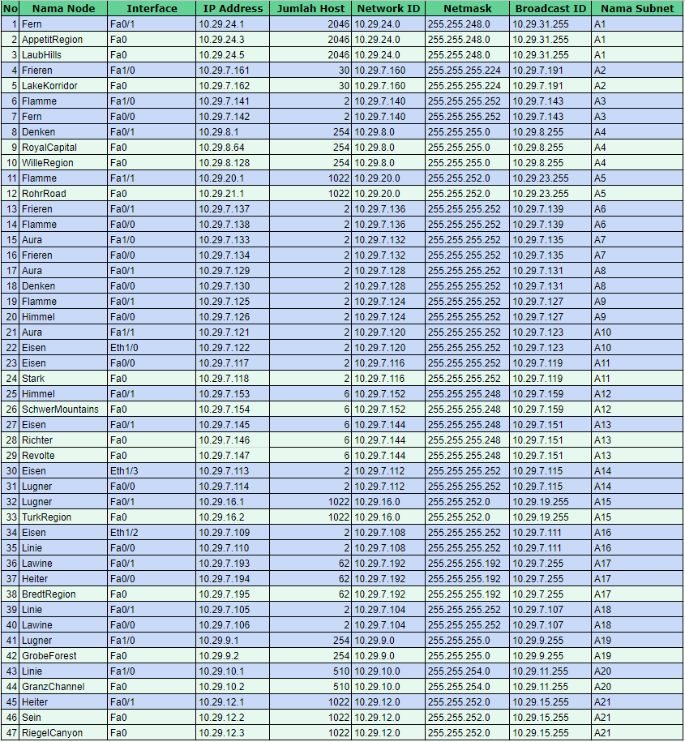
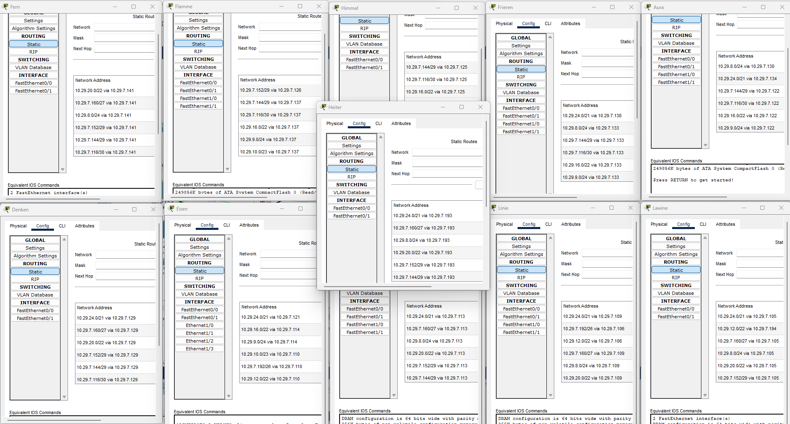

# **Lapres Praktikum Jarkom Modul 4 Kelompok D15**

### **Anggota Kelompok**

| **Nama**                  | **NRP**    |
| ------------------------- | ---------- |
| Rayhan Arvianta Bayuputra | 5025211217 |
| Yehezkiel Wiradhika       | 5025201086 |

## Daftar Isi

- [CIDR](#Konfigurasi-CIDR-pada-GNS3)
- [VLSM](#Konfigurasi-VLSM-pada-CPT)

## Konfigurasi CIDR pada GNS3

### 1. Tentukan subnet yang ada dalam topologi dan lakukan labelling netmask terhadap masing-masing subnet

### 2. Hitung pembagian IP dengan pohon berdasarkan penggabungan subnet yang telah dilakukan

Berdasarkan penghitungan, maka didapatkan pembagian IP sebagai berikut.

## Konfigurasi VLSM pada CPT

### 1. Tentukan subnet yang ada dalam topologi dan lakukan labelling netmask terhadap masing-masing subnet

### 2. Hitung jumlah client per subnet

### 3. Buat VLSM Tree

### 4. Pembagian NID, Netmask, dan BID dari setiap subnet

### 5. Pembagian IP Client per subnet

### 6. Routing via routers untuk connecting semua subnet

> Cuplikan routing diatas hanya cuplikan kecil dari routing pada setiap router. Untuk lebih lengkapnya dapat diakses dari file .pkt yang tersedia.